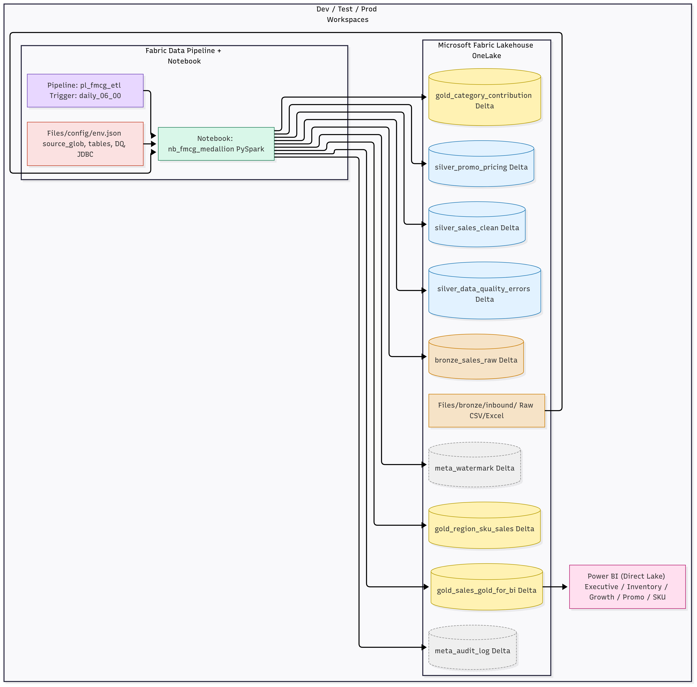
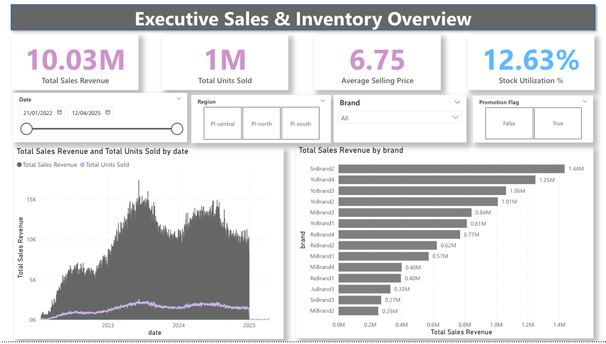
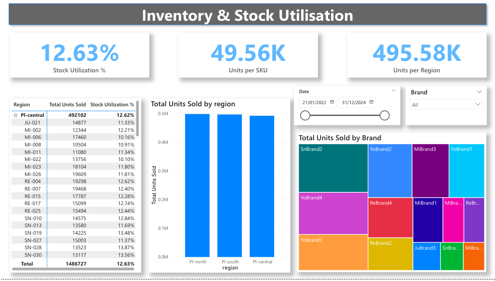
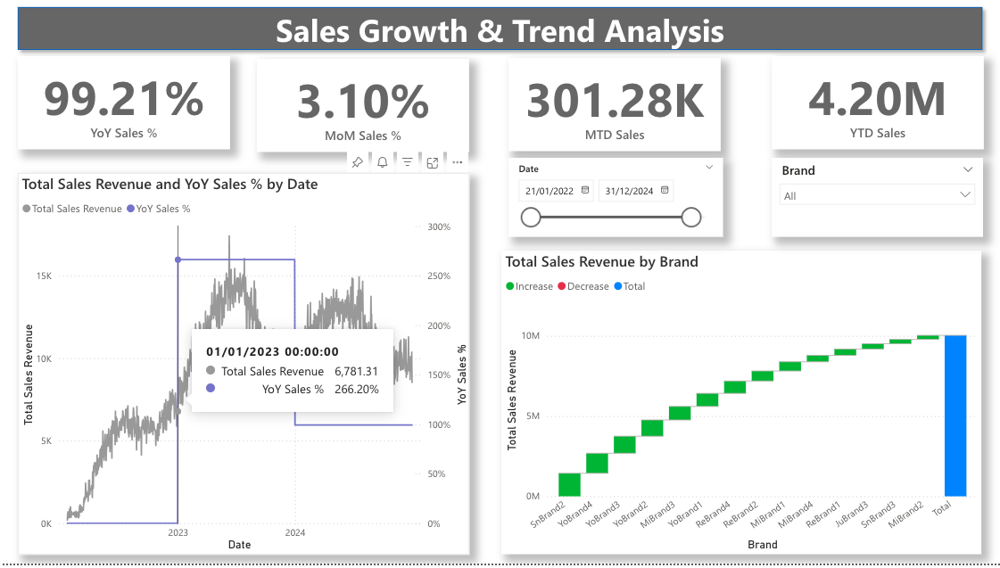
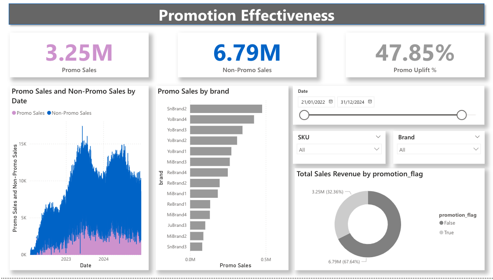
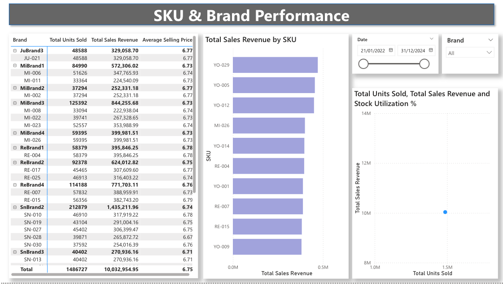

# fmcg-fabric-analytics
Designed a scalable FMCG analytics solution using Microsoft Fabric Lakehouse and Medallion architecture (Bronze, Silver, Gold). Built automated pipelines for incremental loads, applied PySpark transformations, enforced data quality, and delivered Power BI dashboards for sales, inventory, and promotions analysis.

# FMCG Sales & Inventory Analytics (Microsoft Fabric)

## 📌 Project Overview
Designed an end-to-end data engineering and analytics pipeline for FMCG Sales & Inventory, 
leveraging Microsoft Fabric Lakehouse and Medallion architecture (Bronze, Silver, Gold).

## 🎯 Problem Statement
The client wanted automated insights on Sales, Inventory, and Promotions 
across multiple regions and brands, with data quality checks and incremental loads.

## 🛠 Tech Stack
- Microsoft Fabric Lakehouse (OneLake)
- PySpark for ETL
- Delta Lake for incremental loads
- Power BI (Direct Lake mode)
- JSON Config for Dev/Test/Prod

## ⚙️ Solution Architecture

- **Bronze:** Raw CSV files from FMCG data source (OneLake inbound).  
- **Silver:** Standardization (date format, region cleanup, deduplication), Data Quality checks.  
- **Gold:** Aggregates (Sales, Stock Utilization, Promotion impact) exposed for Power BI.  
- **Incremental Load:** Metadata-driven (watermark + audit).  
- **Environment Ready:** Dev/Test/Prod separated by JSON configs.  

## 📊 Power BI Reports
### 1. Executive Dashboard
- KPIs: Total Sales, Units, Avg Price, Stock Utilization
- Trend charts by Date & Region

### 2. Inventory Dashboard
- Stock Utilization %, Units per SKU/Region

### 3. Growth Dashboard
- YoY, MoM, MTD, YTD

### 4. Promotion Dashboard
- Promo Sales vs Non-Promo Sales, Uplift %

### 5. SKU Drilldown
- Brand & SKU-level breakdown with scatter analysis

## ✅ Key Features
- Automated daily pipeline (Fabric Data Pipeline)
- Incremental loading with watermark
- Audit logging & Data Quality checks
- Gold layer optimized for BI (Direct Lake)
- Environment portability (Dev→Test→Prod with JSON configs)

## 🔗 Live Demo
- [Power BI Report Screenshots](./powerbi_reports/)  
- [Code Snippets](./notebooks/)  
- [Config Files](./config/)  

## 📬 Contact

  
  
  
  

